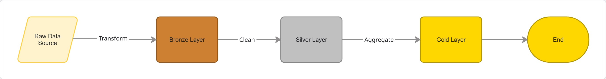
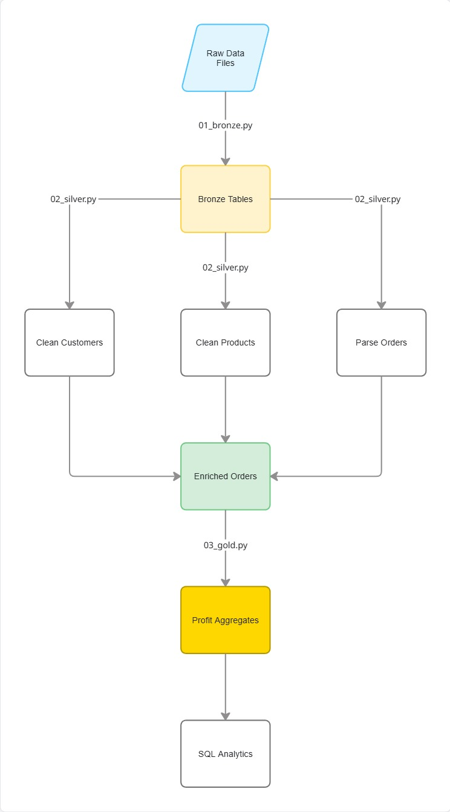
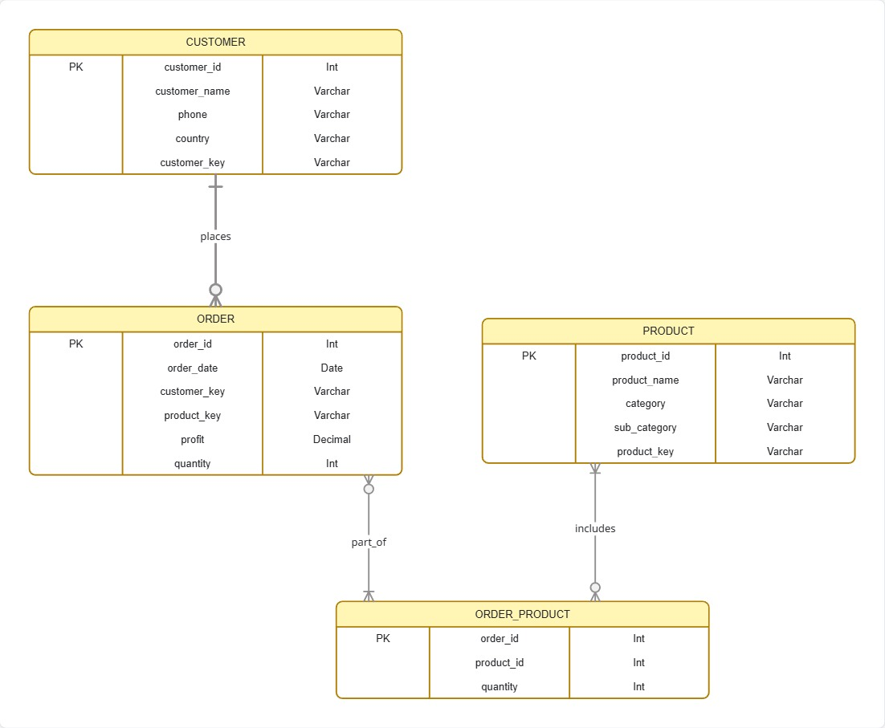

# Sales Analytics Pipeline - E-commerce Data Processing

PySpark-based data pipeline for cleaning and analyzing e-commerce sales data. Implements Bronze-Silver-Gold medallion architecture on Databricks.

---

## Quick Start

```bash
# Install
pip install -e .

# Run tests
pytest tests/test_notebooks.py -v

# Or run all tests
pytest tests/ -v
```

---

## Architecture

### Data Flow



### Pipeline Flow

---

## Data Model

### Entity Relationship

---

## Layer Specifications

### Bronze Layer (01_bronze.py)

**Purpose:** Ingest raw data without transformations

**Input:**
- Customer.xlsx (Excel)
- Products.csv (CSV)
- Orders.json (JSON)

**Output Tables:**
- `sales.bronze.sales_ecommerce_customers`
- `sales.bronze.sales_ecommerce_products`
- `sales.bronze.sales_ecommerce_orders`

**Processing:**
- Load files with schema validation
- Convert column names to snake_case
- Remove duplicates
- Add audit columns (created_at, source_file)

**Load Strategy:**
- **Customers/Products:** Incremental Upsert (Merge) based on unique IDs.
- **Orders:** Full Overwrite (partitioned by `order_date`).

---

### Silver Layer (02_silver.py)

**Purpose:** Clean data and create dimensional model

#### Customer Dimension

**Table:** `sales.silver.dim_customers`

**Transformations:**
1. Clean customer names (remove invalid characters)
2. Format phone numbers
3. Fill missing values (country, city, state, region) with "N/A"
4. Filter outliers ("Sample Company A", etc.)
5. Deduplicate by customer_id
6. Generate surrogate key (customer_key)

**Schema:**
```
customer_id      string
customer_name    string (cleaned)
phone           string (formatted as (xxx) xxx-xxxx xEXT)
email           string
country         string
city            string
state           string
region          string
customer_key    string (MD5 hash)
```

#### Product Dimension

**Table:** `sales.silver.dim_products`

**Transformations:**
1. Fill missing values (category, sub_category) with "N/A"
2. Deduplicate by product_id
3. Generate surrogate key (product_key)

**Schema:**
```
product_id          string
product_name        string
category           string
sub_category       string
price_per_product  double
product_key        string (MD5 hash)
```

#### Enriched Orders

**Table:** `sales.silver.enriched_orders`

**Transformations:**
1. Parse order_date and ship_date (format: d/M/y)
2. Round profit to 2 decimal places
3. Join with customer dimension (get customer_name, country)
4. Join with product dimension (get category, sub_category)
5. Add order_year column

**Schema:**
```
order_id         string
order_date       date
ship_date        date
customer_key     string
product_key      string
customer_name    string (from dim_customers)
country         string (from dim_customers)
category        string (from dim_products)
sub_category    string (from dim_products)
quantity        int
price           double
discount        double
profit          double (rounded to 2 decimals)
order_year      int
```

**Load Strategy:**
- **Dimensions:** SCD Type 2 Merge (maintains history with `effective_date`, `end_date`, `is_current`).
- **Facts:** Incremental Partition Overwrite (supports date-range processing via widgets).

---

### Gold Layer (03_gold.py)

**Purpose:** Business-ready aggregations

**Table:** `sales.gold.sales_ecommerce_profit_aggregates`

**Aggregation:**
```python
df.groupBy("order_year", "category", "sub_category", "customer_name") \
  .agg(round(sum("profit"), 2).alias("total_profit"))
```

**Schema:**
```
order_year      int
category        string
sub_category    string
customer_name   string
total_profit    double (rounded to 2 decimals)
```

**Load Strategy:**
- **Aggregates:** Full Overwrite (partitioned by `order_year`). Re-calculates metrics from Silver data.

---

## Transformation Functions

### Name Cleaning Rules

| Pattern | Rule | Example |
|---------|------|---------|
| `11`, `55` | Convert to ll, ss | Ji11 → Jill |
| `1`, `0`, `5` | Convert to l, o, s | N0ra → Nora |
| `!`, `@` | Convert to i, a | C@thy → Cathy |
| `567` (multi-digit) | Remove | Gary567 Hansen → Gary Hansen |
| `___` | Remove | Willing___)ham → Willingham |
| Large gaps (3+ spaces) | Merge | B     ecky → Becky |
| Single space | Normalize | Shahi  Hopkins → Shahi Hopkins |
| Short fragments | Merge | Kat rina → Katrina |
| Apostrophes | Preserve | O'Rourke → O'Rourke |

**Function:** `clean_customer_names(df)`

---

### Phone Cleaning Rules

| Input Format | Output Format |
|--------------|---------------|
| `(xxx)xxx-xxxx` | `(xxx) xxx-xxxx` |
| `xxx.xxx.xxxx` | `(xxx) xxx-xxxx` |
| `001-xxx-xxx-xxxx` | `(xxx) xxx-xxxx` (removes 001) |
| `xxxxxxxxxx9815` | `(xxx) xxx-xxxx x9815` |
| `#ERROR!` | `NULL` |
| `-xxxx` | `NULL` |

**Function:** `clean_customer_phones(df)`

---

## SQL Analytics Queries

All queries available in `03_gold.py`:

### 1. Profit by Year

```sql
SELECT order_year, ROUND(SUM(total_profit), 2) as annual_profit 
FROM sales.gold.sales_ecommerce_profit_aggregates
GROUP BY order_year 
ORDER BY order_year
```

### 2. Profit by Year + Category

```sql
SELECT order_year, category, ROUND(SUM(total_profit), 2) as category_profit 
FROM sales.gold.sales_ecommerce_profit_aggregates
GROUP BY order_year, category 
ORDER BY order_year, category
```

### 3. Profit by Customer

```sql
SELECT customer_name, ROUND(SUM(total_profit), 2) as customer_profit 
FROM sales.gold.sales_ecommerce_profit_aggregates
GROUP BY customer_name 
ORDER BY customer_profit DESC
```

### 4. Profit by Customer + Year

```sql
SELECT customer_name, order_year, ROUND(SUM(total_profit), 2) as customer_annual_profit 
FROM sales.gold.sales_ecommerce_profit_aggregates
GROUP BY customer_name, order_year 
ORDER BY customer_name, order_year
```

---

## Usage

### Running the Pipeline

Execute notebooks in Databricks:

```
1. 00_cleanup.py      (Optional - resets environment)
2. 01_bronze.py       (Loads raw data into bronze tables)
3. 02_silver.py       (Cleans data and creates dimensions)
4. 03_gold.py         (Creates aggregates and runs SQL)
5. 04_run_tests.py    (Validates results)
```

### Using Transformation Functions

```python
from sales_analytics.transformation import (
    clean_customer_names,
    clean_customer_phones,
    deduplicate,
    generate_surrogate_key
)

# Clean customer data
df_customers = (
    spark.read.parquet("bronze/customers")
    .transform(clean_customer_names)
    .transform(clean_customer_phones)
    .dropna(subset=["customer_id"])
    .transform(lambda df: deduplicate(df, ["customer_id"]))
    .transform(lambda df: generate_surrogate_key(df, ["customer_id"], "customer_key"))
)
```

---

## Testing

### Run Tests

Tests are designed for Databricks environment with pytest.

```bash
# In Databricks, run:
notebooks/04_run_tests.py

# Or locally (in project root):
pytest tests/ -v
```

### Test Files

**test_notebooks.py** - Bronze, Silver, and Gold notebook functions:
- Bronze: schema validation, ingestion mocks, merge logic, pipeline flow
- Silver: customer/product/order transforms, fact table, enriched orders, SCD2 merge
- Gold: profit aggregation, all four SQL queries, gold table write

**test_transformation.py** - Name and phone cleaning regex edge cases  
**test_utils.py** - Delta write, optimize, merge, and SCD2 SQL generation (mocked)  
**test_data_quality.py** - Duplicate detection and quality report

---

## Project Structure

```
customer-product-sales-analytics/
├── src/sales_analytics/
│   ├── transformation.py      # Core transformation functions
│   ├── ingestion.py           # Data loading
│   ├── validation.py          # Data quality checks
│   └── utils.py               # Utilities
│
├── notebooks/
│   ├── 00_cleanup.py          # Environment reset
│   ├── 01_bronze.py           # Raw data ingestion
│   ├── 02_silver.py           # Data cleaning and enrichment
│   ├── 03_gold.py             # Aggregations and SQL queries
│   └── 04_run_tests.py        # Test validation
│
├── tests/
│   ├── conftest.py            # Spark session fixture
│   ├── test_notebooks.py      # Bronze/Silver/Gold pipeline tests
│   ├── test_transformation.py # Name and phone cleaning tests
│   ├── test_utils.py          # Delta I/O utility tests
│   └── test_data_quality.py   # Validation function tests
│
├── setup.py                   # Package setup
└── README.md                  # Complete documentation
```

---

---

## Configuration

### Data Sources (01_bronze.py)

Update these paths before running:

```python
customer_source_path = "/Volumes/sales/raw/data/Customer.xlsx"
product_source_path = "/Volumes/sales/raw/data/Products.csv"
order_source_path = "/Volumes/sales/raw/data/Orders.json"
```

### Table Names

**Bronze:**
- `sales.bronze.sales_ecommerce_customers`
- `sales.bronze.sales_ecommerce_products`
- `sales.bronze.sales_ecommerce_orders`

**Silver:**
- `sales.silver.dim_customers`
- `sales.silver.dim_products`
- `sales.silver.ft_sales_ecommerce_orders`
- `sales.silver.enriched_orders`

**Gold:**
- `sales.gold.sales_ecommerce_profit_aggregates`

---

## License

MIT License

---

## Version

**Version:** 1.0.0  
**Last Updated:** February 2026  
**Status:** Production Ready
